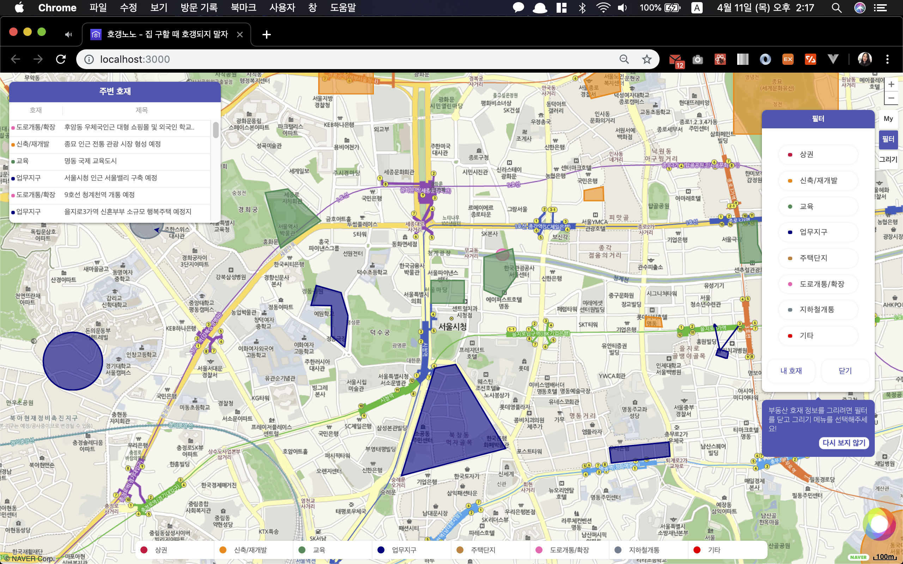
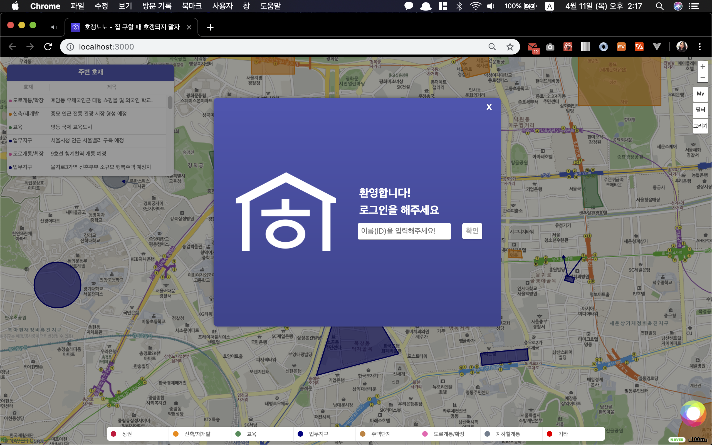
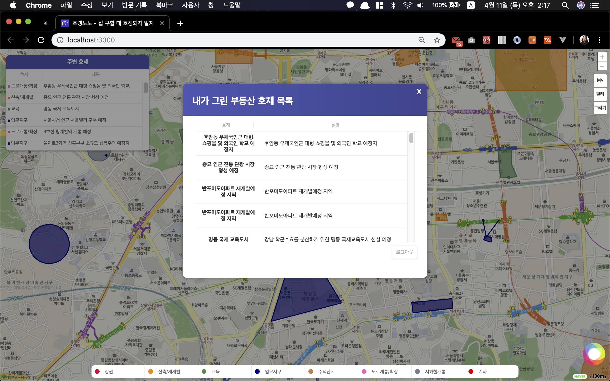

# Codestates X Hogangnono
[](https://lernajs.io/)
[](https://reactjs.org/)
[](https://d3js.org/)

호갱노노 x Codestates Project: 여기호재

## 기본 환경 설치

<ul>
<li>node@latest</li>
<li>yarn@latest</li>
<li>eslint-hogangnono</li>
</ul>

## 패키지 설치
1. `root`(CODESTATES), 클라이언트, 서버 폴더 별로 `npm install` or `yarn`으로 설치합니다.
```shell
$ npm install
$ cd packages/client/
$ npm install
$ cd ../server ( 또는 `root`(CODESTATES)에서 cd packages/server/ )
$ npm install
```
2. `root`에서 `npm run start` 실행하시면 됩니다. 자동으로 브라우저(`localhost:3000`)에서 뜹니다.   

### yarn 설치

```javascript
$ sudo npm install -g yarn

```
### 프로젝트 패키지 설치

```javascript
$ yarn

or 

$ npm install
```

### Package Dependencies

These are installed when running `yarn` or `npm install`

- [D3](https://d3js.org/)
- [axios](https://www.npmjs.com/package/axios)
- [prop-types](https://www.npmjs.com/package/prop-types)
- [react-icons](https://www.npmjs.com/package/react-icons)
- [Less](http://lesscss.org/)
- [Express](https://www.npmjs.com/package/express)
  
_Note:_   
Ejected [create-react-app](https://github.com/facebook/create-react-app) and brought in server-side rendering from Less

## Project Description

- Naver 지도 API에서 제공하는 CustomOverlayView 클래스를 이용하여 D3로 SVG 도형 그리기 기능 구현
- 여러 도형을 Custom Overlay로 하나씩 생성 
- Naver 지도 API 이벤트 시스템에서 제공하는 addListener와 react event listener를 연결하여 원하는 위치에 도형을 그릴 수 있는 기능 구현
- 현재 지도의 'Viewport’ bound data (lat, long, center point)에 따라 도형이 나타남.
  - 드래깅에 따라서 지도에 뜨는 도형 업데이트

### Client Interface

### `전체 화면`
<br />
> 전체 화면의 모습입니다. `주변호재` `My` `필터` `그리기` 메뉴로 나뉘여 있습니다.<br />
<br />

### `주변호재`
<br />
> 화면 좌측 상단에 유저가 보는 화면(Viewport)의 중심점이 변경될 경우 주변의 부동산호재 정보를 계속해서 서버로부터 불러와 화면에 보여줍니다.<br />

### `My`
<br />
<br />
> 화면 우측 상단에 있는 `My` 버튼을 누르면 이름을 입력하여 로그인을 할 수 있고, 로그인 후에는 내가 그린 도형(부동산 호재)의 리스트를 볼 수 있습니다.<br />

### `필터`
<br />
> 화면 좌측 상단에 유저가 보는 화면(Viewport)의 중심점이 변경될 경우 주변의 부동산호재 정보를 계속해서 서버로부터 불러와 화면에 보여줍니다.<br />

### `그리기`
<br />
> - 점, 사각형, 원 : 마우스 왼쪽 클릭으로 시작 -> 마우스 왼쪽 클릭으로 도형그리기 종료
> - 화살표, 다각형: 마우스 왼쪽 클릭으로 시작 -> 마우스 오른쪽 클릭으로 도형그리기 종료